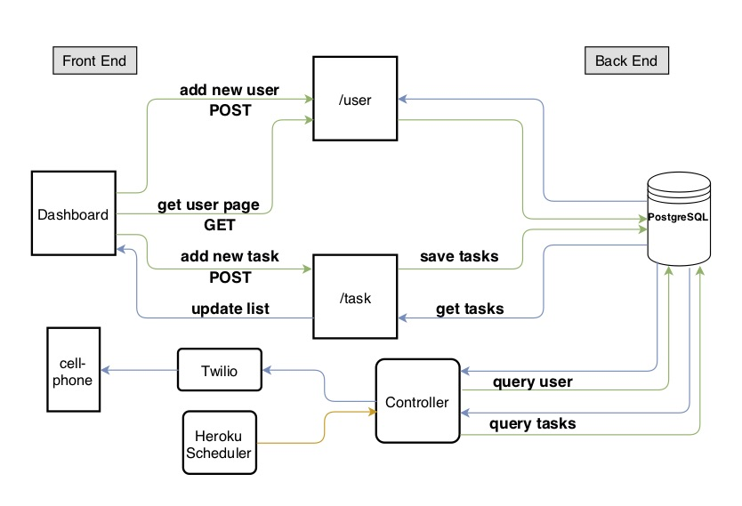

# Focalist: A Reminder App
## Project Description
This is a web application that allows users to create scheduled reminder text messages that are texted to the user at the specified date and time. 


## Contributors
### [Quang Nguyen](https://github.com/TheQuangNguyen)


I am from Vietnam.
I graduated from UW with mechanical engineering degree.
I like software development because I can contribute in creating product that other people use. Plus it is just fun.
I write in Java because it is a widely used backend language and it is very versatile in what the language can do.
Find me on [LinkedIn](https://www.linkedin.com/in/quangnguyendev/) and on [GitHub](https://github.com/TheQuangNguyen).

### [Sharina Stubbs](https://github.com/SharinaS?tab=repositories)


A software developer with a background in medicine, music, and competitive team sailing. Committed to building high-quality solutions for global and business solutions. Dedicated to accountable and adaptable teamwork. Find me on [LinkedIn](https://www.linkedin.com/in/sharina-stubbs/) and on [GitHub](https://github.com/SharinaS).

### [Ahren Swett](https://github.com/ahrenswett)
 

I'm a software developer who is dedicated to bringing innovative problem-solving  skills I’ve gained after 9 years of military service as a medic, and 4 years of entrepreneurial endeavors, including customer service, teamwork, and leadership, into the world of software development.

# Wireframes for App
Wireframes can be viewed within our public [Trello Board](https://trello.com/b/9v2P4pvL/team-focalpoint). 

# Domain Modeling and Database-Entity-Relationship Diagrams
## Domain-Modeling:


## Database-Entity-Relationship:


# User Stories
Read the [user stories](https://github.com/401-Focal-Point/Focalist/blob/master/USERSTORIES.md) in our repo.

# How to Use Focalist
To view and try out the app, head over to our deployed site on Heroku: [FocaList](https://focalistapp.herokuapp.com.).

1. Clone the App
2. Sign up with Twilio and get Twilio Account SID, Token and Trial Number numbers
3. Set up Env variables
    * TWILIO_ACCOUNT_SID
    * TWILIO_AUTH_TOKEN
    * TILIO_TRIAL_NUMBER
    * DATABASE_URL
    * POSTGRESQL_USERNAME
    * POSTGRESQL_PASSWORD
4. Deploy to Heroku (and note your application url)
5. Set up a Heroku Scheduler using the following command for a new job task with a free dyno and a 10 minute schedule. This command will activate any unsent messages scheduled within the next ten minutes. This command can also be run in the command line. 
```
curl -s [the-application-url]/api/schedule
```
6. To check your Heroku postgres database, run the following command in your terminal:
```
$ heroku pg:psql
```

# References

<!-- Thank you for these references! I was really concerned about where some of your Twilio code came from. -->
- [Spring Boot - How to send sms using Twilio API (2019)](https://www.youtube.com/watch?v=OuBttmaPlhM)
- [Appointment Reminders with Java and Spark](https://www.twilio.com/docs/sms/tutorials/appointment-reminders-java-spark)

